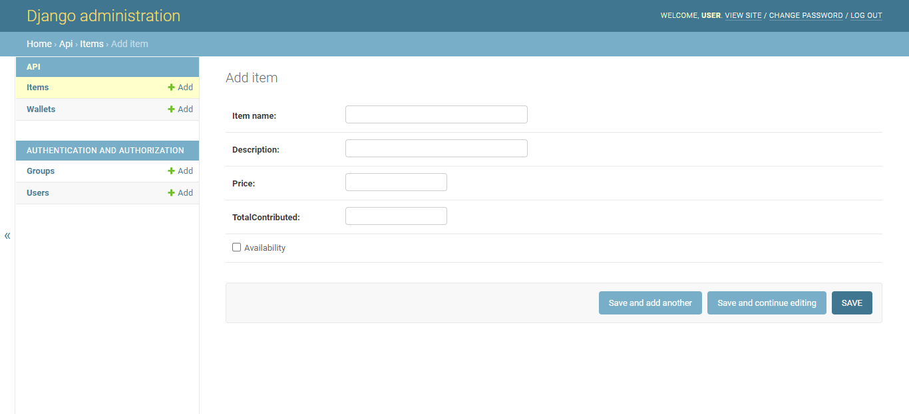

# OT-Coin-System

This app contains two backend apps.

The first is a python backed backend that is connected to a PostgresQL database that stores items and the OTCoin wallet.

## Api Routes

**domain/**
> Api root homepage - Displays all api endpoints

**domain/items**
> Get items info 

**domain/wallets**
> Get Wallets info

**domain/admin**
> route that allows administrative users to modify database. 

Allows User handling and Group Management.

Allows database manipulation

**domain/admin/api/item/add/**
> route that enables administrative users to add items to database 

### Fields
Item name = Item offered by employer
Description = Description of item
Price - Price of item in OTC
TotalContributed - Amount employees contributed to item in OTC
Availability - Boolean value showing whether object is available for purchase

**domain/admin/api/wallet/add/**
> route that enables administrative users to add coins to wallets 

### Fields
Amount = Total OTCoins earned. 300 minutes -- 1 OTCoin
OTHours = Total Over time  in minutes.

Additional Backend that provisions user management written in Node.js.

## Coming soon

Linking each User model with a Wallet model so that they may purchase or contribute OTC coins to an item.

User permissions that allow employees to view, reccomend and contribute to items only.

Allows purchasing of items and removes availability of an item after purchasing.

Automatic conversion of OT Hours to OTCoins.

Add Front end integration